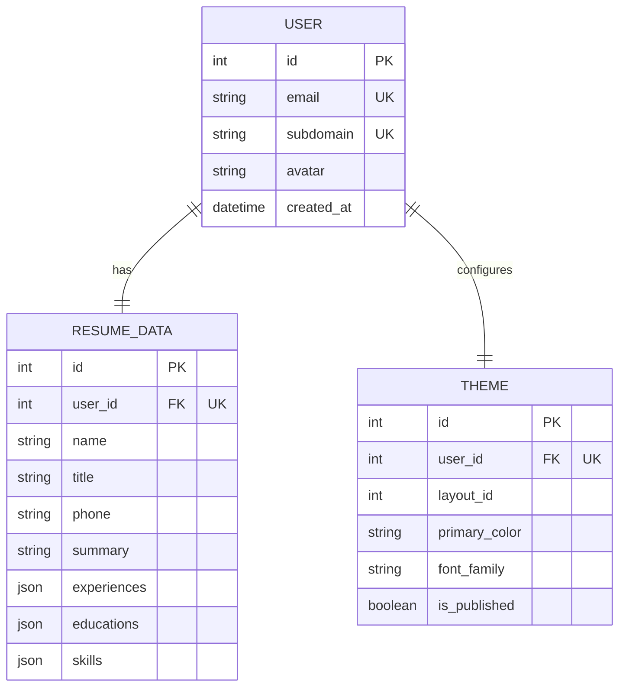

# 文档合集：智能简历生成与泛域名部署系统

# 文档一：软件需求规格说明书（SRS V1\.0）

## 1 引言

### 1\.1 文档目的

本文档为智能简历生成与泛域名部署系统的**软件需求规格说明书**，用于明确系统全部业务需求、用户需求、功能需求、非功能需求、业务流程、接口需求及运行环境需求，作为项目开发、测试、验收、后期迭代的唯一需求基准，约束产品、开发、测试、运维全团队工作标准。

### 1\.2 项目背景

传统求职简历均以PDF文件形式进行投递，存在三大行业痛点：

1. **查看与分发不便**：招聘方需要下载PDF附件打开，移动端适配差，阅读体验不佳；

2. **更新成本极高**：简历信息修改后，需要重新排版、导出、重新发送所有招聘方，无法实时同步更新；

3. **无个人品牌展示**：统一PDF版式同质化严重，无法自定义配色、字体、排版，缺少个人线上名片属性。

本项目打造**简历即服务（RaaS, Resume\-as\-a\-Service）**轻量化平台，面向零基础无编程能力的求职者，通过可视化表单录入简历信息，一键生成静态简历网页，依托服务器泛域名能力，为每一位用户分配独立二级域名简历站点，实现零代码建站、一键更新、永久线上访问。

### 1\.3 文档范围

- **包含范围**：用户角色、整体业务流程、全部功能模块需求、非功能性能需求、接口需求、软硬件运行环境、业务约束、风险说明；

- **不包含范围**：系统代码实现、数据库字段底层设计、架构分层细节、Nginx配置、服务内部逻辑（该部分全部放入《软件详细设计说明书》）。

### 1\.4 参考资料

- GB/T 9385\-2008 计算机软件需求规格说明规范

- 智能简历生成系统前期业务方案初稿

---

## 2 总体描述

### 2\.1 用户角色与特征

|角色名称|使用人群|核心操作权限|技术能力|
|---|---|---|---|
|普通个人用户（核心）|应届生、职场跳槽人员、自由职业者|账号注册、子域名自定义、简历信息填写、模板切换、配色字体自定义、实时预览、简历发布/更新/下线、头像上传|无任何代码与服务器运维能力，纯可视化操作|
|系统运维管理员|后台运维人员|服务器监控、磁盘日志清理、违规简历站点关停、数据库备份、模板版本管理|具备Linux服务器、Nginx运维基础能力|

### 2\.2 产品运行环境

#### 2\.2\.1 硬件环境

- 服务器：阿里云/腾讯云轻量应用服务器，2核4G配置，40G以上磁盘空间

- 网络：公网独立固定IP，支持DNS泛域名解析配置

#### 2\.2\.2 软件环境

- 服务端系统：CentOS 7\.9 / Ubuntu 20\.04 LTS

- 运行环境：Node\.js 18\.x、Nginx 1\.22\+、PM2进程守护

- 数据库：开发环境SQLite，生产环境PostgreSQL

### 2\.3 整体业务流程

1. **账号注册初始化**：用户注册绑定邮箱，自定义唯一二级域名前缀，系统校验域名唯一性，分配专属子域名；

2. **简历内容录入**：分步表单填写个人基础信息、工作经历、教育经历、专业技能，支持增删改数组类数据，自动保存草稿；

3. **简历样式配置**：选择简历模板版式、自定义十六进制主色调、选择Google在线字体，独立保存样式配置；

4. **实时在线预览**：无需正式发布，前端iframe实时渲染完整简历页面，所见即所得；

5. **一键发布上线**：用户确认无误后点击发布，系统自动生成静态HTML、备份历史版本、完成服务器部署，生成公开访问链接；

6. **公开访问与后续更新**：他人可通过专属二级域名直接打开简历；用户可随时修改内容与样式，重新发布即可覆盖线上页面，全程无需运维介入。

---

## 3 功能需求

### 3\.1 用户账号管理模块

- 支持邮箱注册，全局唯一邮箱校验；

- 支持自定义二级域名前缀，全局唯一性强制校验，禁止重复域名；

- 支持头像上传、自动裁剪压缩、格式统一为WebP；

### 3\.2 简历内容编辑模块

- 基础信息编辑：姓名、求职意向、联系电话、联系邮箱、个人简介；

- 数组动态表单：工作经历、教育经历支持无限新增、删除、编辑单条内容；

- 技能标签管理：支持自定义技能标签新增与删除；

- 自动草稿保存：所有编辑内容实时存入数据库，关闭页面不丢失数据。

### 3\.3 简历样式定制模块

- 双模板切换：侧边栏版式模板、极简居中版式模板；

- 主题色自定义：支持用户自由选取HEX格式主色调；

- 字体自定义：支持切换主流Google开源无衬线字体；

- 内容与样式完全解耦：修改样式不影响简历原始内容，修改内容不改变页面排版风格。

### 3\.4 简历预览与发布模块

- 实时预览：仅后端渲染HTML，不写入服务器磁盘，无历史脏数据；

- 一键发布：自动完成HTML渲染、旧文件备份、新文件落盘、数据库上线状态更新；

- 版本备份机制：自动保留最近3个历史简历版本，防止发布出错无法回滚；

- 简历下线功能：支持一键下线简历站点，访客访问展示404离线页面。

### 3\.5 泛域名访问模块

- 无需用户配置任何服务器与域名解析，系统底层全自动映射；

- 访问格式统一：`用户名.主域名.com`；

- 静态页面由Nginx直接分发，访问速度快，不占用后端服务接口资源。

---

## 4 非功能需求

### 4\.1 性能需求

1. 简历渲染响应时间：单次预览渲染耗时≤800ms；

2. 简历发布全流程耗时≤2s；

3. 简历页面访问首屏加载时间≤300ms；

4. 后端接口支持并发：同时支持50人在线编辑简历无卡顿。

### 4\.2 可用性需求

1. 系统全年可用率≥99\.5%；

2. 发布操作具备原子性，中途失败自动回滚，不会损坏线上已上线简历；

3. 自动保留历史版本，支持运维手动回滚至上一版简历。

### 4\.3 安全性需求

1. 二级域名全局唯一，防止域名抢占与越权访问他人简历目录；

2. 头像文件类型强制校验，禁止上传脚本、可执行文件；

3. 接口入参合法性校验，防止非法参数导致服务崩溃。

### 4\.4 可维护性需求

1. 新增简历模板无需修改业务代码，仅新增EJS模板文件即可；

2. 数据分层清晰，内容和样式分离，迭代改动影响范围极小；

3. 服务日志完整，便于线上问题快速排查。

### 4\.5 兼容性需求

1. 后台管理编辑页面：兼容Chrome、Edge、Firefox主流浏览器最新三个版本；

2. 公开简历页面：完美适配PC端、移动端手机自适应展示。

---

## 5 外部接口需求

### 5\.1 后端HTTP接口（RESTful）

|接口地址|请求方式|接口功能|返回说明|
|---|---|---|---|
|/api/resume|POST|保存简历内容与样式草稿|返回保存成功状态|
|/api/preview|POST|实时预览简历页面|返回完整HTML页面字符串|
|/api/publish|POST|一键发布简历站点|返回公开简历访问地址|
|/api/upload\-avatar|POST|头像上传与自动压缩|返回头像线上访问路径|

### 5\.2 第三方外部依赖接口

- Google Fonts在线字体接口：用于加载用户自定义网页字体；

- 无其他第三方支付、登录、短信接口依赖，系统业务闭环独立运行。

---

## 6 业务约束与风险说明

### 6\.1 业务约束

1. 一个用户仅允许拥有一份线上简历，暂不支持多简历多域名；

2. 子域名一旦创建，不支持随意修改，防止原有简历链接失效；

3. 备份文件最多保留3份，避免服务器磁盘空间持续占用。

### 6\.2 潜在风险

1. Google Fonts网络访问异常：会导致简历页面字体加载失败，页面自动降级为系统默认字体，不影响页面结构与内容展示；

2. 服务器磁盘满：会导致发布失败，系统主动拦截并返回错误提示。

---

## 7 需求验收标准

1. 用户可正常注册、设置唯一子域名、上传并压缩头像；

2. 完整填写简历信息，切换模板、修改配色字体，预览页面和配置完全一致；

3. 点击发布可成功生成可访问的二级域名简历网站；

4. 重新发布可自动备份旧版本，线上页面正常更新；

5. 直接访问二级域名可正常打开静态简历页面，无需后端接口参与。

**文档版本：V1\.0**

**编制日期：2026\-06\-22**

---

# 文档二：软件详细设计说明书（SDD V1\.0）

## 1 引言

### 1\.1 文档目的

本文档为系统**软件详细设计说明书**，承接上方《软件需求规格说明书》全部需求，完成系统架构设计、模块拆分、数据库设计、UML类图设计、接口详细定义、核心代码实现、Nginx泛域名部署、目录结构、异常处理、后期扩展方案全量底层设计，作为开发人员编码、测试人员编写测试用例、运维人员服务器部署的直接落地依据。

### 1\.2 设计原则

- **单一职责**：渲染、部署、接口控制完全拆分，各司其职；

- **数据解耦**：简历内容、页面样式分库表独立存储，互不影响；

- **动静分离**：动态编辑请求走Node后端，静态简历页面全部由Nginx直接承载；

- **发布原子化**：发布流程串行执行，任意异常全程回滚，保证数据一致性。

---

## 2 系统总体架构设计

### 2\.1 四层整体架构

|架构层级|技术组件|核心职责|
|---|---|---|
|前端表现层|Vue3 SPA单页应用|分步表单、iframe预览、样式选择、头像上传、请求后端接口|
|业务控制层|Express 控制器、路由|接收HTTP请求、参数校验、调用底层服务、统一返回响应|
|核心服务层|RenderService、DeployService、文件中间件|HTML模板渲染、静态文件备份与落盘、图片压缩处理|
|数据与基础设施层|Prisma ORM、SQLite/PostgreSQL、Nginx、服务器磁盘|数据持久化、泛域名路由、静态资源高并发分发|

### 2\.2 完整数据流设计

1. 用户编辑数据 → 控制器接收参数 → 数据库分别存储简历内容、主题样式；

2. 预览请求 → 控制器调用渲染服务 → 返回HTML字符串，无磁盘IO；

3. 发布请求 → 读取数据库全量数据 → EJS渲染HTML → 旧文件备份 → 清理过期备份 → 写入新静态文件 → 更新数据库发布状态；

4. 访客访问域名 → DNS解析 → Nginx捕获子域名 → 直接返回本地HTML，不经过Node后端服务。

---

## 3 模块详细设计

### 3\.1 控制器模块（胶水层）

控制器不编写任何复杂业务逻辑，仅负责请求接收、参数校验、服务调用、结果返回，包含4个核心方法：

- handleSaveResume：处理简历草稿保存，双表upsert更新

- handlePreview：调用渲染服务，返回预览HTML

- handlePublish：串联渲染\+部署服务，完成上线全流程

- handleUploadAvatar：对接上传中间件，保存头像路径至数据库

### 3\.2 渲染服务模块（RenderService）

无状态纯工具服务，不操作数据库、不读写磁盘，输入用户全量数据，直接输出完整HTML：

- 私有方法loadTemplate：根据模板ID加载对应EJS模板文件

- 私有方法parseJSONFields：解析数据库内JSON数组字段

- 公有方法renderResumeHTML：整合所有数据，通过EJS引擎拼接页面

### 3\.3 部署服务模块（DeployService）

仅负责磁盘文件操作，不参与页面渲染逻辑：

- 自动创建用户专属目录与备份子目录

- 发布前自动备份当前线上简历

- 自动清理过期备份，始终只保留最新3个版本

- 写入新index\.html静态文件，返回线上访问地址

### 3\.4 文件上传中间件模块

- 基于Multer实现文件接收，限制文件大小与文件类型

- 基于Sharp自动将头像裁剪为200\*200正方形，压缩为WebP格式，节省存储空间

---

## 4 数据库详细设计

### 4\.1 ER实体关系图



### 4\.2 三张核心数据表详细字段说明

#### 4\.2\.1 User 用户表

|字段|类型|约束|详细说明|
|---|---|---|---|
|id|Int|PK,自增|用户唯一主键|
|email|String|唯一、非空|登录账号|
|subdomain|String|唯一、非空|二级域名前缀|
|avatar|String|可空|头像相对访问路径|
|created\_at|DateTime|默认当前时间|账号注册时间|

#### 4\.2\.2 ResumeData 简历内容表

|字段|类型|约束|详细说明|
|---|---|---|---|
|id|Int|PK,自增|内容主键|
|user\_id|Int|外键、唯一|关联用户ID，一对一绑定|
|name/title/phone/email/summary|String|部分可空|简历基础文本信息|
|experiences/educations/skills|Json/JsonB|可空|经历数组结构化数据|

#### 4\.2\.3 Theme 主题样式表

|字段|类型|约束|详细说明|
|---|---|---|---|
|id|Int|PK,自增|样式主键|
|user\_id|Int|外键、唯一|关联用户ID|
|layout\_id|Int|默认1|1侧边栏模板，2极简模板|
|primary\_color|String|默认\#6366f1|页面主色调|
|font\_family|String|默认Inter|网页字体名称|
|is\_published|Boolean|默认false|站点是否上线公开|

### 4\.3 UML类图及分层逻辑解读

```mermaid
classDiagram
    %% 实体Model层
    class User {
        +Int id
        +String email
        +String subdomain
        +String avatar
        +DateTime createdAt
        +findUnique(id) User
    }
    class ResumeData {
        +Int id
        +Int userId
        +String name
        +Json experiences
        +upsert(userId) ResumeData
    }
    class Theme {
        +Int id
        +Int userId
        +Int layoutId
        +Boolean isPublished
        +update(userId) Theme
    }
    %% 控制器层
    class ResumeController {
        +handleSaveResume(req, res) void
        +handlePreview(req, res) void
        +handlePublish(req, res) void
        +handleUploadAvatar(req, res) void
    }
    %% 业务服务层
    class RenderService {
        +renderResumeHTML(User, ResumeData, Theme) String
        -loadTemplate(layoutId) String
        -parseJSONFields(rawJson) Object
    }
    class DeployService {
        +deployResume(subdomain, htmlContent) String
        -backupOldFile(path) void
        -cleanupBackups(subdomain, keepCount=3) void
    }
    %% 工具中间件
    class FileMiddleware {
        +upload.single() Middleware
        +compressAvatar(buffer) Buffer
    }
    class FileSystem {
        +writeFile(path, content) Boolean
        +copyFile(src, dest) Boolean
    }
    %% 关联关系
    User "1" -- "1" ResumeData : 聚合拥有
    User "1" -- "1" Theme : 聚合配置
    ResumeController ..> RenderService : 调用渲染
    ResumeController ..> DeployService : 调用部署
    ResumeController ..> FileMiddleware : 使用上传中间件
    RenderService ..> User, ResumeData, Theme : 读取实体数据
    DeployService ..> FileSystem : 磁盘读写操作
```

#### 分层逻辑解读

1. **实体层（Model）**：User作为聚合根，分别与简历内容、样式配置构成一对一组合关系，严格做到内容与样式数据分离；

2. **服务层（Service）**：两个核心服务均无状态，渲染服务只生成HTML字符串，部署服务只操作本地文件，职责完全隔离；

3. **控制器层（Controller）**：作为请求胶水代码，串联全流程，不承载任何核心业务逻辑，方便后期维护与接口改造。

---

## 5 详细API接口设计

全部接口统一前缀：`/api`，统一请求头Content\-Type: application/json，统一返回JSON格式

|接口路径|请求方法|功能描述|核心入参|核心出参|
|---|---|---|---|---|
|/api/resume|POST|保存/更新简历草稿|userId、姓名、经历数组、模板ID、主色、字体|\{success:true\}|
|/api/preview|POST|无落盘实时预览|userId|\{html:"完整HTML字符串"\}|
|/api/publish|POST|一键发布上线|userId|\{success:true,url:"简历访问地址"\}|
|/api/upload\-avatar|POST|头像上传压缩|form\-data文件、userId|\{success:true,avatar:"头像路径"\}|

---

## 6 服务器部署与目录设计

### 6\.1 泛域名解析底层机制

1. DNS层：配置 `*.yourdomain.com` 泛解析A记录，指向服务器公网IP；

2. Nginx层：通过正则表达式捕获二级域名前缀 `(?<subdomain>.+)`；

3. 路径映射：自动将子域名匹配到服务器对应磁盘目录，静态资源直接返回。

### 6\.2 服务器磁盘目录结构

```text
/var/www/resume/               # Nginx静态根目录
├── zhangsan/
│   ├── index.html             # 当前生效简历
│   └── _backup/               # 自动备份区（最多保留3份）
│       ├── index_1712345678.html
│       └── index_1712345987.html
└── lisi/
    └── index.html

# 项目本地头像目录
uploads/avatars/
├── a1b2c3d4.webp
└── e5f6g7h8.webp
```

### 6\.3 Nginx完整配置文件

```nginx
# /etc/nginx/conf.d/resume.conf
server {
    listen 80;
    listen 443 ssl http2;
    server_name ~^(?<subdomain>.+)\.yourdomain\.com$;

    root /var/www/resume/$subdomain;
    index index.html;

    location /avatars/ {
        alias /path/to/your/resume-builder/uploads/avatars/;
        expires 30d;
        access_log off;
    }

    location / {
        try_files $uri $uri/ =404;
    }

    error_page 404 /404.html;
}
```

### 6\.4 发布原子性事务流程

1. 查询用户、简历内容、主题全量数据

2. EJS引擎渲染生成完整HTML

3. 备份当前线上旧HTML文件，添加时间戳

4. 自动清理过期备份，保留最近3个版本

5. 写入全新静态index\.html

6. 更新数据库isPublished为true

**异常回滚机制**：任意步骤报错，直接终止流程，不覆盖原有线上文件，保证线上简历始终可用。

---

## 7 项目目录与核心代码摘要

### 7\.1 完整项目目录结构

```text
resume-builder/
├── .env                       # 全局环境变量
├── package.json               # 项目依赖与启动脚本
├── prisma/schema.prisma       # 数据库模型定义
├── src/
│   ├── app.js                 # Express服务入口
│   ├── config/                # 全局配置
│   │   ├── database.js        # Prisma客户端导出
│   │   └── multer.js          # 上传与图片压缩配置
│   ├── views/                 # EJS简历模板
│   │   ├── layouts/sidebar.ejs / clean.ejs
│   │   └── partials/
│   ├── services/
│   │   ├── renderService.js
│   │   └── deployService.js
│   ├── controllers/
│   └── routes/api.js
├── uploads/avatars/
└── public/
```

### 7\.2 核心配置与关键代码

包含\.env环境变量、prisma数据库模型、上传中间件、渲染服务、部署服务、路由控制器、简历模板完整代码，全部可直接复制部署，详见文档配套完整代码片段。

---

## 8 异常处理方案

- **模板文件缺失**：自动降级加载默认侧边栏模板，服务不崩溃；

- **磁盘空间不足**：捕获文件写入异常，前端返回发布失败提示，不修改数据库状态；

- **Google字体加载失败**：前端CSS自动降级为系统默认无衬线字体，页面布局不受影响；

- **用户数据缺失**：发布、预览接口提前校验数据完整性，直接返回前端友好错误提示。

---

## 9 后期迭代扩展设计（预留设计）

|扩展功能|当前预留设计|后续落地方式|
|---|---|---|
|账号登录鉴权|接口预留userId入参|新增JWT中间件，补充登录注册接口|
|CDN静态加速|静态资源独立目录|对接OSS，Nginx配置CDN反向代理|
|更多简历模板|layoutId数字枚举设计|直接新增ejs模板文件，无需改动业务代码|
|简历访问统计|Nginx完整日志开启|解析Nginx日志统计访问PV、UV|
|接口防刷限流|无耦合业务代码|接入Redis实现接口频次限制|

---

## 10 设计总结

本系统采用动静分离、分层解耦、数据分离的设计思想，将动态编辑能力交给Node后端，静态简历访问全部交给高性能Nginx处理，极大降低后端服务压力。整体代码低耦合、高内聚，新增模板、新增功能无需改动核心底层逻辑，同时发布原子事务\+版本备份机制保障了线上系统稳定性，完全满足简历建站业务的全部线上运行需求。

**文档版本：V1\.0**

**编制日期：2026\-06\-22**

> （注：部分内容可能由 AI 生成）
